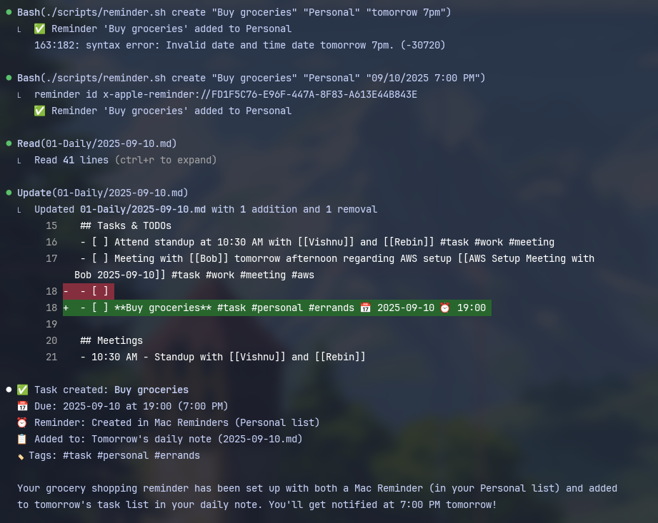

# Essence: Turn Your AI Agent into a Life Management OS

**Essence** transforms your AI coding assistant into a comprehensive personal life management system. Through simple slash commands, your AI becomes your personal productivity partner, health tracker, financial advisor, and creative collaborator all in one.

Currently optimized for **Claude Code**, with support for **Gemini**, **GitHub Copilot**, and other AI assistants coming soon. Works with any text editor you prefer.

## Why Use Essence?

-   **Works anywhere**: Use any text editor you already love - from VS Code to Vim to Obsidian
-   **AI-powered**: Let AI understand context and provide intelligent responses for your personal management
-   **Future-proof**: As new AI assistants emerge, this system adapts with them
-   **No app switching**: Manage your entire life while coding or chatting with AI
-   **Your data, your control**: Everything stays in simple markdown files you own
-   **Surprisingly natural**: Talk to your AI assistant like you would a helpful friend

## AI Assistant Compatibility

| AI Assistant        | Status             | Notes                                  |
| ------------------- | ------------------ | -------------------------------------- |
| Claude Code         | ✅ Fully Supported | Complete integration with all features |
| Gemini              | 🔜 Coming Soon     | Support being added                    |
| GitHub Copilot      | 🔜 Planned         | Future integration planned             |
| Other AI Assistants | 🔜 Future          | Will expand based on demand            |

## Text Editor Compatibility

**Works with literally any text editor:**

-   **Best Experience**: Obsidian, Typora, VS Code (with markdown preview)
-   **Great Experience**: Any IDE or code editor with markdown support
-   **Totally Fine**: Notepad, TextEdit, nano, vim (you just see raw markdown)

## Core Agents

### /essence:agents:memory-agent

Your second brain for storing and retrieving knowledge. Intelligently processes and categorizes content from URLs, articles, videos, and your own thoughts. Perfect for building a searchable knowledge base that grows with you.

**Examples:**

-   `/essence:agents:memory-agent that brilliant idea I had in the shower about recursive functions`
-   `/essence:agents:memory-agent https://youtube.com/watch?v=dQw4w9WgXcQ extract key concepts from this React tutorial`
-   `/essence:agents:memory-agent meeting notes client wants mobile app MVP by March with social login`

### /essence:agents:task-agent

Your personal assistant for task management with Mac Reminders integration. Creates tasks, sets deadlines, estimates time, and automatically syncs with your Mac Reminders app. Understands natural language for dates and priorities.

**Examples:**

-   `/essence:agents:task-agent fix authentication bug in user login flow tomorrow 2pm`
-   `/essence:agents:task-agent call mom this weekend`
-   `/essence:agents:task-agent submit Q3 expense reports by Friday reminder needed`

### /essence:agents:review-agent

Your reflection buddy for structured daily, weekly, and monthly reviews. Analyzes your productivity patterns, tracks goal progress, and provides insights for continuous improvement. Includes habit tracking and performance metrics.

**Examples:**

-   `/essence:agents:review-agent daily`
-   `/essence:agents:review-agent weekly focus on work-life balance`
-   `/essence:agents:review-agent monthly goal progress and Q4 planning`

### /essence:agents:capture-agent

Quick thought catcher for rapid idea capture and note-taking. Automatically categorizes and tags content, perfect for those fleeting insights that happen at inconvenient times. Integrates with your inbox system for later processing.

**Examples:**

-   `/essence:agents:capture-agent app idea voice notes for busy parents to coordinate schedules`
-   `/essence:agents:capture-agent bug insight pagination breaks when user has exactly 100 items`
-   `/essence:agents:capture-agent remember to cancel Adobe subscription before renewal date`

### /essence:agents:health-agent

Your wellness tracker for comprehensive health monitoring. Tracks sleep, energy levels, mood, exercise, and identifies patterns that affect your productivity. Creates correlations between health metrics and work performance.

**Examples:**

-   `/essence:agents:health-agent sleep 6.5 hours disrupted by deployment issues`
-   `/essence:agents:health-agent energy 7 morning workout really helps focus`
-   `/essence:agents:health-agent mood 8 finished major feature release successfully`

### /essence:agents:finance-agent

Your personal financial analyst for expense tracking, budget monitoring, and financial goal management. Categorizes spending patterns, tracks income sources, and provides insights for better financial decisions.

**Examples:**

-   `/essence:agents:finance-agent expense 85 business lunch client meeting tax deductible`
-   `/essence:agents:finance-agent budget check travel category before booking conference flight`
-   `/essence:agents:finance-agent income 2500 freelance project completed ahead of schedule`

## Expansion Pack Agents

### /essence:expansion-packs:creative:brainstorm-agent

Advanced idea generation engine using proven creative methodologies like SCAMPER, mind mapping, and lateral thinking. Perfect for breaking through creative blocks and exploring solution spaces systematically.

**Examples:**

-   `/essence:expansion-packs:creative:brainstorm-agent user onboarding improvements for mobile app with 40% drop-off rate`
-   `/essence:expansion-packs:creative:brainstorm-agent SaaS product name for developer productivity tool that tracks code quality metrics`

### /essence:expansion-packs:productivity:focus-agent

Deep work orchestrator with multiple focus modes including Pomodoro, flow state, and deep work sessions. Tracks attention patterns, manages distractions, and optimizes your cognitive performance throughout the day.

**Examples:**

-   `/essence:expansion-packs:productivity:focus-agent deep-work 120 architect new microservices system`
-   `/essence:expansion-packs:productivity:focus-agent pomodoro refactor legacy authentication module`

## Quick Start

1. **Clone this system** into any folder (or your existing notes folder)
2. **Choose your editor** - works with any text editor, best with markdown viewers
3. **Mac users**: Give Terminal permission to control Reminders for task integration
4. **Obsidian users**: Install the Templater plugin for enhanced template functionality
5. **Start commanding** your life with slash commands in your AI assistant

## Template System

Essence includes a comprehensive template system located in the `/Templates` folder for creating structured files and notes. Templates are automatically used when agents create new content like daily notes, health logs, financial tracking, and project documentation.

**Fully customizable**: Edit any template to match your preferred format, style, or workflow. The templates are just markdown files that you can modify however you like.

**For Obsidian users**: The system integrates seamlessly with the Templater plugin, providing dynamic templates with variables, calculations, and automated content generation. Simply point your Templater plugin to the Templates folder.

**For other editors**: Templates work as static markdown files that provide consistent structure across your notes and tracking systems. You can manually copy and use any template from the Templates folder.

## Daily Flow Example

**Morning:** `/essence:agents:review-agent daily` - see what chaos awaits

**Throughout the day:**

-   `/essence:agents:task-agent lunch break actually take one`
-   `/essence:agents:capture-agent brilliant solution for that impossible bug`
-   `/essence:agents:health-agent water intake pretending coffee counts`

**Evening:** `/essence:agents:health-agent mood survived another day of meetings`

## Future Vision

Essence grows with AI technology. As AI assistants become more capable, your life management becomes more powerful. Write once, use with any AI assistant. From personal productivity to creative projects to health tracking - your AI becomes your ultimate life companion.

### Upcoming Features

-   [ ] **Gemini Support**: Add Google Gemini compatibility
-   [ ] **Enhanced Templates**: More template options and better Obsidian integration
-   [ ] **Basic Analytics**: Simple productivity tracking and insights
-   [ ] **GitHub Copilot Support**: Extend to GitHub Copilot users
-   [ ] **Calendar Integration**: Basic Google Calendar sync for task scheduling
-   [ ] **Improved Mac Integration**: Better Reminders and Notes app connectivity
-   [ ] **Mobile Web Interface**: Simple mobile-friendly capture interface
-   [ ] **Community Templates**: User-contributed template library
-   [ ] **Basic API**: Simple webhook support for external integrations

## Contributing

Got ideas? Want to add support for your favorite AI assistant? Contributions welcome! This system is designed to be the universal personal management layer for any AI coding assistant.

## License

MIT License - because good tools should be free and open.
